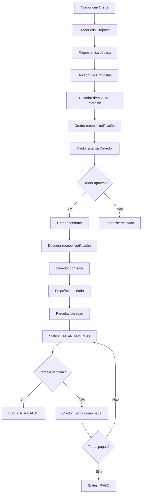

# 📋 PLANO ARQUITETURAL - AGILIT LOAN
## Sistema de Ofertas e Propostas de Empréstimo

---

## 🎯 VISÃO GERAL DO FLUXO DE NEGÓCIO

### Fluxo Principal

```
CREDOR cria OFERTA → CREDOR cria PROPOSTA (baseada em OFERTA) 
→ DEVEDOR vê PROPOSTAS públicas → DEVEDOR demonstra INTERESSE 
→ CREDOR recebe NOTIFICAÇÃO → CREDOR analisa DEVEDOR 
→ Ambos CONFIRMAM → EMPRÉSTIMO criado com PARCELAS
```

---

## 📊 ANÁLISE DETALHADA DO FLUXO

### 1️⃣ FASE: CRIAÇÃO DE OFERTA (Credor)

**Ator:** Credor  
**Ação:** Criar Oferta de Empréstimo

**Dados Informados pelo Credor:**
- Valor total disponível
- Número mínimo de parcelas (ex: 1x)
- Número máximo de parcelas (ex: 12x)
- Dias até primeira cobrança (ex: 30 dias)
- Taxa de juros (% ao mês ou total)

**Cálculos Automáticos do Sistema:**
- Valor de cada parcela (para cada opção de parcelamento)
- Data da primeira parcela (data atual + dias informados)
- Valor total com juros

**Operações Disponíveis:**
- ✅ Criar Oferta
- ✅ Listar Minhas Ofertas
- ✅ Ver Detalhes da Oferta
- ✅ Deletar Oferta
- ✅ Criar Proposta a partir da Oferta
- ❌ Editar Oferta (NÃO permitido)

---

### 2️⃣ FASE: CRIAÇÃO DE PROPOSTA (Credor)

**Ator:** Credor  
**Ação:** Transformar Oferta em Proposta Pública

**Dados da Proposta:**
- Todos os dados da Oferta original
- ID Público único (formato: #ABC123)
- Nome do Credor
- Status: ATIVA, CANCELADA, ACEITA

**Visibilidade:**
- ✅ Todos os Devedores podem ver
- ✅ Credor pode ver suas próprias propostas

**Operações Disponíveis:**
- ✅ Criar Proposta (a partir de Oferta)
- ✅ Listar Propostas Públicas (Devedor)
- ✅ Listar Minhas Propostas (Credor)
- ✅ Cancelar Proposta (Credor)
- ✅ Ver Detalhes da Proposta

---

### 3️⃣ FASE: MANIFESTAÇÃO DE INTERESSE (Devedor)

**Ator:** Devedor  
**Ação:** Aceitar termos e pedir empréstimo

**Dados Necessários do Devedor:**
- Nome completo
- CPF
- Telefone
- Email
- Endereço completo
- Outras informações relevantes

**Operações Disponíveis:**
- ✅ Ver todas as Propostas disponíveis
- ✅ Ver detalhes de uma Proposta
- ✅ Demonstrar interesse (Aceitar termos)
- ✅ Cancelar interesse

**Sistema Automático:**
- Criar registro de Interesse
- Enviar Notificação ao Credor
- Adicionar Devedor à lista de interessados

---

### 4️⃣ FASE: ANÁLISE E APROVAÇÃO (Credor)

**Ator:** Credor  
**Ação:** Analisar interessados e aprovar empréstimo

**Informações Visíveis:**
- Lista de todos os interessados na proposta
- Dados completos do Devedor:
  - Nome, CPF, Telefone, Email
  - Endereço completo
  - Histórico (se houver)

**Operações Disponíveis:**
- ✅ Ver lista de interessados
- ✅ Ver perfil completo do Devedor
- ✅ Aprovar empréstimo (iniciar confirmação)
- ✅ Rejeitar interesse

---

### 5️⃣ FASE: CONFIRMAÇÃO BILATERAL

**Atores:** Credor + Devedor  
**Ação:** Ambos confirmam o empréstimo

**Fluxo:**
1. Credor seleciona "Fazer Empréstimo"
2. Sistema gera menu de confirmação
3. Credor confirma
4. Devedor recebe notificação
5. Devedor confirma
6. Sistema cria Empréstimo

**Validações:**
- Ambos devem confirmar
- Credor deve ter saldo disponível
- Proposta deve estar ativa

---

### 6️⃣ FASE: GESTÃO DO EMPRÉSTIMO

**Status do Empréstimo:**
- **EM_ANDAMENTO:** Empréstimo ativo com parcelas pendentes
- **PAGO:** Todas as parcelas quitadas
- **ATRASADO:** Pelo menos uma parcela vencida não paga

**Gestão de Parcelas:**
- Cada parcela tem:
  - Número da parcela
  - Valor
  - Data de vencimento
  - Status: PENDENTE, PAGA, ATRASADA
  - Data de pagamento (quando paga)

**Operações do Credor:**
- ✅ Ver lista de empréstimos
- ✅ Ver detalhes do empréstimo
- ✅ Marcar parcela como paga
- ✅ Ver histórico de pagamentos

**Operações do Devedor:**
- ✅ Ver meus empréstimos
- ✅ Ver parcelas pendentes
- ✅ Ver histórico de pagamentos

**Automações do Sistema:**
- Verificar diariamente parcelas vencidas
- Atualizar status para ATRASADO
- Enviar notificações de vencimento
- Atualizar status para PAGO quando todas as parcelas forem pagas

---

## 🗂️ ENTIDADES NECESSÁRIAS

### ✅ Entidades Existentes (Precisam Ajustes)

#### 1. Credor
**Campos Atuais:**
- id, nome, email, saldoDisponivel, clientes

**Campos FALTANDO (conforme especificação):**
- cpf (String, unique)
- telefone (String)
- senhaHash (String)

**Relacionamentos:**
- OneToMany → Devedor (clientes)
- OneToMany → OfertaEmprestimo
- OneToMany → PropostaEmprestimo
- OneToMany → Emprestimo

---

#### 2. Devedor
**Campos Atuais:**
- id, nome, cpf, telefone, email, senhaHash, credor, emprestimos

**Campos FALTANDO:**
- endereco (String ou objeto Endereco)
- cidade (String)
- estado (String)
- cep (String)
- dataNascimento (LocalDate)
- renda (Double) - opcional

**Relacionamentos:**
- ManyToOne → Credor
- OneToMany → Emprestimo
- OneToMany → InteresseProposta

---

#### 3. Emprestimo
**Campos Atuais:**
- id, devedor, credor, valorPrincipal, jurosAplicados, valorTotal, dataInicio, dataVencimento, status

**Campos FALTANDO:**
- numeroParcelas (Integer)
- parcelasPagas (Integer)
- propostaOrigem (ManyToOne → PropostaEmprestimo)

**Relacionamentos:**
- ManyToOne → Devedor
- ManyToOne → Credor
- ManyToOne → PropostaEmprestimo
- OneToMany → Parcela

**Status Enum:**
- EM_ANDAMENTO
- PAGO
- ATRASADO

---

### 🆕 Entidades NOVAS a Criar

#### 4. OfertaEmprestimo
**Descrição:** Oferta criada pelo Credor (privada, apenas para ele)

**Campos:**
- id (Long, PK)
- credor (ManyToOne → Credor)
- valorDisponivel (Double)
- parcelasMinimas (Integer) - ex: 1
- parcelasMaximas (Integer) - ex: 12
- diasAtePrimeiraCobranca (Integer)
- taxaJuros (Double) - percentual
- dataCriacao (LocalDateTime)
- ativa (Boolean)

**Relacionamentos:**
- ManyToOne → Credor
- OneToMany → PropostaEmprestimo

**Operações:**
- CREATE, READ, DELETE (sem UPDATE)

---

#### 5. PropostaEmprestimo
**Descrição:** Proposta pública derivada de uma Oferta

**Campos:**
- id (Long, PK)
- idPublico (String, unique) - formato #ABC123
- ofertaOrigem (ManyToOne → OfertaEmprestimo)
- credor (ManyToOne → Credor)
- nomeCredor (String) - desnormalizado para performance
- valorDisponivel (Double)
- parcelasMinimas (Integer)
- parcelasMaximas (Integer)
- diasAtePrimeiraCobranca (Integer)
- taxaJuros (Double)
- dataCriacao (LocalDateTime)
- status (Enum: ATIVA, CANCELADA, ACEITA)

**Campos Calculados (podem ser métodos ou campos):**
- valorParcela (Map<Integer, Double>) - valor para cada opção de parcelas
- dataPrimeiraParcela (LocalDate)

**Relacionamentos:**
- ManyToOne → OfertaEmprestimo
- ManyToOne → Credor
- OneToMany → InteresseProposta
- OneToMany → Emprestimo

**Operações:**
- CREATE (a partir de Oferta), READ, CANCEL

---

#### 6. InteresseProposta
**Descrição:** Registro de interesse de um Devedor em uma Proposta

**Campos:**
- id (Long, PK)
- proposta (ManyToOne → PropostaEmprestimo)
- devedor (ManyToOne → Devedor)
- dataInteresse (LocalDateTime)
- status (Enum: PENDENTE, APROVADO, REJEITADO, CANCELADO)
- mensagem (String) - opcional, mensagem do devedor
- confirmacaoCredor (Boolean)
- confirmacaoDevedor (Boolean)
- dataConfirmacaoCredor (LocalDateTime)
- dataConfirmacaoDevedor (LocalDateTime)

**Relacionamentos:**
- ManyToOne → PropostaEmprestimo
- ManyToOne → Devedor

**Operações:**
- CREATE (demonstrar interesse)
- READ (listar interessados)
- UPDATE (aprovar, rejeitar, confirmar)
- DELETE (cancelar interesse)

---

#### 7. Parcela
**Descrição:** Parcela individual de um Empréstimo

**Campos:**
- id (Long, PK)
- emprestimo (ManyToOne → Emprestimo)
- numeroParcela (Integer) - 1, 2, 3...
- valor (Double)
- dataVencimento (LocalDate)
- dataPagamento (LocalDate) - null se não paga
- paga (Boolean)
- atrasada (Boolean)
- diasAtraso (Integer) - calculado

**Relacionamentos:**
- ManyToOne → Emprestimo

**Operações:**
- CREATE (automático ao criar empréstimo)
- READ
- UPDATE (marcar como paga)

---

#### 8. Notificacao
**Descrição:** Sistema de notificações para usuários

**Campos:**
- id (Long, PK)
- destinatario (String) - pode ser Credor ou Devedor
- tipoDestinatario (Enum: CREDOR, DEVEDOR)
- destinatarioId (Long)
- tipo (Enum: NOVO_INTERESSE, APROVACAO, CONFIRMACAO, VENCIMENTO, ATRASO)
- titulo (String)
- mensagem (String)
- lida (Boolean)
- dataCriacao (LocalDateTime)
- dataLeitura (LocalDateTime)
- referencia (String) - ID da entidade relacionada
- tipoReferencia (String) - tipo da entidade

**Operações:**
- CREATE (automático pelo sistema)
- READ (listar notificações)
- UPDATE (marcar como lida)
- DELETE

---

## 🔄 RELACIONAMENTOS ENTRE ENTIDADES

```
Credor 1---* OfertaEmprestimo
Credor 1---* PropostaEmprestimo
Credor 1---* Emprestimo
Credor 1---* Devedor

OfertaEmprestimo 1---* PropostaEmprestimo

PropostaEmprestimo 1---* InteresseProposta
PropostaEmprestimo 1---* Emprestimo

Devedor 1---* InteresseProposta
Devedor 1---* Emprestimo

Emprestimo 1---* Parcela

InteresseProposta *---1 PropostaEmprestimo
InteresseProposta *---1 Devedor
```

---

## 🎮 CONTROLLERS NECESSÁRIOS

### 1. OfertaEmprestimoController
**Path:** `/api/oferta`

**Endpoints:**
- `POST /` - Criar oferta
- `GET /` - Listar ofertas do credor logado
- `GET /{id}` - Ver detalhes da oferta
- `DELETE /{id}` - Deletar oferta
- `POST /{id}/criar-proposta` - Criar proposta a partir da oferta

---

### 2. PropostaEmprestimoController
**Path:** `/api/proposta`

**Endpoints:**
- `GET /publicas` - Listar todas as propostas ativas (para Devedores)
- `GET /minhas` - Listar propostas do credor logado
- `GET /{idPublico}` - Ver detalhes da proposta
- `PUT /{id}/cancelar` - Cancelar proposta

---

### 3. InteressePropostaController
**Path:** `/api/interesse`

**Endpoints:**
- `POST /` - Demonstrar interesse (Devedor)
- `GET /proposta/{propostaId}` - Listar interessados (Credor)
- `GET /meus` - Listar meus interesses (Devedor)
- `PUT /{id}/aprovar` - Aprovar interesse (Credor)
- `PUT /{id}/rejeitar` - Rejeitar interesse (Credor)
- `PUT /{id}/confirmar-credor` - Credor confirma empréstimo
- `PUT /{id}/confirmar-devedor` - Devedor confirma empréstimo
- `DELETE /{id}` - Cancelar interesse (Devedor)

---

### 4. EmprestimoController (Atualizar)
**Path:** `/api/emprestimo`

**Novos Endpoints:**
- `GET /credor/{credorId}` - Listar empréstimos do credor
- `GET /devedor/{devedorId}` - Listar empréstimos do devedor
- `GET /{id}/parcelas` - Listar parcelas do empréstimo
- `PUT /parcela/{parcelaId}/pagar` - Marcar parcela como paga

---

### 5. NotificacaoController
**Path:** `/api/notificacao`

**Endpoints:**
- `GET /` - Listar notificações do usuário
- `GET /nao-lidas` - Listar notificações não lidas
- `PUT /{id}/marcar-lida` - Marcar como lida
- `DELETE /{id}` - Deletar notificação

---

## 🔧 UTILITÁRIOS E SERVIÇOS

### 1. CalculadoraEmprestimo (Utility Class)
**Localização:** `com.agilit.util.CalculadoraEmprestimo`

**Métodos:**
- `calcularValorParcela(valorTotal, numeroParcelas, taxaJuros)` → Double
- `calcularValorTotalComJuros(valorPrincipal, taxaJuros, numeroParcelas)` → Double
- `calcularDataParcelas(dataInicio, numeroParcelas, diasEntreParcelas)` → List<LocalDate>
- `calcularJurosSimples(valor, taxa, periodo)` → Double
- `calcularJurosCompostos(valor, taxa, periodo)` → Double

---

### 2. GeradorIdPublico (Utility Class)
**Localização:** `com.agilit.util.GeradorIdPublico`

**Métodos:**
- `gerar()` → String (formato: #ABC123)
- `validar(String id)` → Boolean

**Implementação:**
- Usar Random + caracteres alfanuméricos
- Garantir unicidade (verificar no banco)
- Formato: # + 6 caracteres (letras maiúsculas + números)

---

### 3. VerificadorStatusEmprestimo (Utility Class)
**Localização:** `com.agilit.util.VerificadorStatusEmprestimo`

**Métodos:**
- `verificarParcelas(Emprestimo)` → void
- `atualizarStatusEmprestimo(Emprestimo)` → void
- `verificarAtrasos()` → void (job diário)

**Lógica:**
- Verificar se alguma parcela está vencida e não paga → ATRASADO
- Verificar se todas as parcelas estão pagas → PAGO
- Caso contrário → EM_ANDAMENTO

---

### 4. NotificacaoService (Utility Class)
**Localização:** `com.agilit.util.NotificacaoService`

**Métodos:**
- `notificarNovoInteresse(Credor, PropostaEmprestimo, Devedor)` → void
- `notificarAprovacao(Devedor, InteresseProposta)` → void
- `notificarConfirmacao(Usuario, Emprestimo)` → void
- `notificarVencimento(Devedor, Parcela)` → void
- `notificarAtraso(Devedor, Parcela)` → void

---

## 📋 DAOs NECESSÁRIOS

### 1. OfertaEmprestimoDAO
**Queries:**
- `findByCredorId(Long credorId)` → List<OfertaEmprestimo>
- `findByCredorIdAndAtiva(Long credorId, Boolean ativa)` → List<OfertaEmprestimo>

---

### 2. PropostaEmprestimoDAO
**Queries:**
- `findByStatus(StatusProposta status)` → List<PropostaEmprestimo>
- `findByCredorId(Long credorId)` → List<PropostaEmprestimo>
- `findByIdPublico(String idPublico)` → PropostaEmprestimo
- `findAtivasPublicas()` → List<PropostaEmprestimo>

---

### 3. InteressePropostaDAO
**Queries:**
- `findByPropostaId(Long propostaId)` → List<InteresseProposta>
- `findByDevedorId(Long devedorId)` → List<InteresseProposta>
- `findByPropostaIdAndStatus(Long propostaId, StatusInteresse status)` → List<InteresseProposta>

---

### 4. ParcelaDAO
**Queries:**
- `findByEmprestimoId(Long emprestimoId)` → List<Parcela>
- `findParcelasVencidas()` → List<Parcela>
- `findParcelasPendentes(Long emprestimoId)` → List<Parcela>

---

### 5. NotificacaoDAO
**Queries:**
- `findByDestinatario(String tipo, Long id)` → List<Notificacao>
- `findNaoLidas(String tipo, Long id)` → List<Notificacao>

---

## 🔐 VALIDAÇÕES E REGRAS DE NEGÓCIO

### Criação de Oferta
- ✅ Credor deve estar autenticado
- ✅ Valor deve ser > 0
- ✅ Parcelas mínimas >= 1
- ✅ Parcelas máximas >= parcelas mínimas
- ✅ Taxa de juros >= 0
- ✅ Dias até primeira cobrança >= 0

### Criação de Proposta
- ✅ Oferta deve existir e estar ativa
- ✅ Oferta deve pertencer ao credor
- ✅ Gerar ID público único
- ✅ Copiar todos os dados da oferta

### Demonstração de Interesse
- ✅ Devedor deve estar autenticado
- ✅ Proposta deve estar ativa
- ✅ Devedor não pode ter interesse duplicado na mesma proposta
- ✅ Devedor deve ter dados completos (endereço, etc.)

### Aprovação de Empréstimo
- ✅ Credor deve ser o dono da proposta
- ✅ Interesse deve estar pendente
- ✅ Credor deve ter saldo disponível
- ✅ Ambos devem confirmar

### Criação de Empréstimo
- ✅ Ambas confirmações devem estar true
- ✅ Criar todas as parcelas automaticamente
- ✅ Calcular datas de vencimento
- ✅ Atualizar saldo do credor
- ✅ Atualizar status da proposta para ACEITA
- ✅ Enviar notificações

### Pagamento de Parcela
- ✅ Apenas credor pode marcar como paga
- ✅ Parcela deve pertencer a empréstimo do credor
- ✅ Registrar data de pagamento
- ✅ Atualizar status do empréstimo
- ✅ Verificar se todas as parcelas foram pagas

---

## 🚀 ORDEM DE IMPLEMENTAÇÃO RECOMENDADA

### FASE 1: Correções e Ajustes Base
1. ✅ Corrigir modelo Credor (adicionar cpf, telefone, senhaHash)
2. ✅ Corrigir modelo Devedor (adicionar endereço completo)
3. ✅ Criar utilitários básicos (CalculadoraEmprestimo, GeradorIdPublico)

### FASE 2: Entidades Novas
4. ✅ Criar OfertaEmprestimo
5. ✅ Criar PropostaEmprestimo
6. ✅ Criar InteresseProposta
7. ✅ Criar Parcela
8. ✅ Atualizar Emprestimo (adicionar relacionamento com Parcela)

### FASE 3: Controllers de Oferta e Proposta
9. ✅ Criar OfertaEmprestimoController
10. ✅ Criar PropostaEmprestimoController
11. ✅ Implementar cálculos automáticos

### FASE 4: Sistema de Interesse
12. ✅ Criar InteressePropostaController
13. ✅ Implementar fluxo de confirmação bilateral

### FASE 5: Gestão de Empréstimos
14. ✅ Atualizar EmprestimoController
15. ✅ Criar ParcelaController
16. ✅ Implementar lógica de status

### FASE 6: Notificações
17. ✅ Criar Notificacao entity
18. ✅ Criar NotificacaoController
19. ✅ Criar NotificacaoService
20. ✅ Integrar notificações em todos os fluxos

### FASE 7: DAOs e Otimizações
21. ✅ Criar DAOs necessários
22. ✅ Otimizar queries
23. ✅ Adicionar índices no banco

---

## 📊 DIAGRAMA DE FLUXO COMPLETO



---

## ✅ CHECKLIST DE IMPLEMENTAÇÃO

### Modelos
- [ ] Corrigir Credor
- [ ] Corrigir Devedor
- [ ] Criar OfertaEmprestimo
- [ ] Criar PropostaEmprestimo
- [ ] Criar InteresseProposta
- [ ] Criar Parcela
- [ ] Criar Notificacao
- [ ] Atualizar Emprestimo

### Controllers
- [ ] OfertaEmprestimoController
- [ ] PropostaEmprestimoController
- [ ] InteressePropostaController
- [ ] Atualizar EmprestimoController
- [ ] ParcelaController
- [ ] NotificacaoController

### Utilitários
- [ ] CalculadoraEmprestimo
- [ ] GeradorIdPublico
- [ ] VerificadorStatusEmprestimo
- [ ] NotificacaoService

### DAOs
- [ ] OfertaEmprestimoDAO
- [ ] PropostaEmprestimoDAO
- [ ] InteressePropostaDAO
- [ ] ParcelaDAO
- [ ] NotificacaoDAO

### Testes
- [ ] Testar criação de oferta
- [ ] Testar criação de proposta
- [ ] Testar demonstração de interesse
- [ ] Testar confirmação bilateral
- [ ] Testar criação de empréstimo
- [ ] Testar pagamento de parcelas
- [ ] Testar mudança de status
- [ ] Testar notificações

---

## 🎯 PRÓXIMOS PASSOS

Após aprovação deste plano, seguir para implementação na seguinte ordem:

1. **Corrigir modelos existentes** (Credor e Devedor)
2. **Criar utilitários** (CalculadoraEmprestimo, GeradorIdPublico)
3. **Criar novas entidades** (OfertaEmprestimo, PropostaEmprestimo, etc.)
4. **Implementar controllers** seguindo o padrão estabelecido
5. **Criar DAOs** conforme necessidade
6. **Implementar sistema de notificações**
7. **Testes e validações**

---

**Documento criado em:** 2025-12-02  
**Versão:** 1.0  
**Status:** Aguardando aprovação