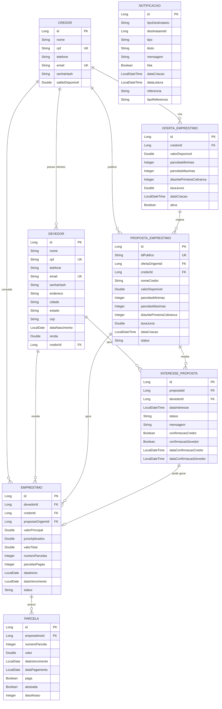

# 🗂️ DIAGRAMA DE RELACIONAMENTOS - AGILIT LOAN

## 📊 Diagrama Entidade-Relacionamento (ER)



---

## 🔗 DETALHAMENTO DOS RELACIONAMENTOS

### 1. CREDOR ↔ DEVEDOR
**Tipo:** One-to-Many (1:N)  
**Descrição:** Um Credor pode ter múltiplos Devedores como clientes

```java
// Em Credor.java
// @OneToMany(mappedBy = "credor", cascade = CascadeType.ALL) // EXEMPLO COM CASCADE
@OneToMany(mappedBy = "credor", fetch = FetchType.LAZY)
private List<Devedor> clientes;

// Em Devedor.java
@ManyToOne
@JoinColumn(name = "credor_id")
private Credor credor;
```

**Regras:**
- Um Devedor pertence a apenas um Credor
- Um Credor pode ter vários Devedores
- Relacionamento opcional (Devedor pode não ter Credor associado inicialmente)

---

### 2. CREDOR ↔ OFERTA_EMPRESTIMO
**Tipo:** One-to-Many (1:N)  
**Descrição:** Um Credor pode criar múltiplas Ofertas

```java
// Em Credor.java
@OneToMany(mappedBy = "credor", fetch = FetchType.LAZY)
private List<OfertaEmprestimo> ofertas;

// Em OfertaEmprestimo.java
@ManyToOne
@JoinColumn(name = "credor_id", nullable = false)
private Credor credor;
```

**Regras:**
- Toda Oferta deve ter um Credor (obrigatório)
- Um Credor pode ter múltiplas Ofertas ativas
- Ofertas são privadas (apenas o Credor vê)

---

### 3. CREDOR ↔ PROPOSTA_EMPRESTIMO
**Tipo:** One-to-Many (1:N)  
**Descrição:** Um Credor pode publicar múltiplas Propostas

```java
// Em Credor.java
@OneToMany(mappedBy = "credor", fetch = FetchType.LAZY)
private List<PropostaEmprestimo> propostas;

// Em PropostaEmprestimo.java
@ManyToOne
@JoinColumn(name = "credor_id", nullable = false)
private Credor credor;
```

**Regras:**
- Toda Proposta deve ter um Credor (obrigatório)
- Propostas são públicas (todos os Devedores veem)
- Credor pode cancelar suas Propostas

---

### 4. OFERTA_EMPRESTIMO ↔ PROPOSTA_EMPRESTIMO
**Tipo:** One-to-Many (1:N)  
**Descrição:** Uma Oferta pode originar múltiplas Propostas

```java
// Em OfertaEmprestimo.java
@OneToMany(mappedBy = "ofertaOrigem", fetch = FetchType.LAZY)
private List<PropostaEmprestimo> propostas;

// Em PropostaEmprestimo.java
@ManyToOne
@JoinColumn(name = "oferta_origem_id", nullable = false)
private OfertaEmprestimo ofertaOrigem;
```

**Regras:**
- Toda Proposta deve ter uma Oferta de origem
- Uma Oferta pode gerar várias Propostas
- Proposta herda dados da Oferta no momento da criação

---

### 5. PROPOSTA_EMPRESTIMO ↔ INTERESSE_PROPOSTA
**Tipo:** One-to-Many (1:N)  
**Descrição:** Uma Proposta pode receber múltiplos Interesses

```java
// Em PropostaEmprestimo.java
@OneToMany(mappedBy = "proposta", fetch = FetchType.LAZY)
private List<InteresseProposta> interesses;

// Em InteresseProposta.java
@ManyToOne
@JoinColumn(name = "proposta_id", nullable = false)
private PropostaEmprestimo proposta;
```

**Regras:**
- Uma Proposta pode ter vários Devedores interessados
- Cada Devedor pode demonstrar interesse apenas uma vez por Proposta
- Interesse pode ser cancelado pelo Devedor

---

### 6. DEVEDOR ↔ INTERESSE_PROPOSTA
**Tipo:** One-to-Many (1:N)  
**Descrição:** Um Devedor pode demonstrar interesse em múltiplas Propostas

```java
// Em Devedor.java
@OneToMany(mappedBy = "devedor", fetch = FetchType.LAZY)
private List<InteresseProposta> interesses;

// Em InteresseProposta.java
@ManyToOne
@JoinColumn(name = "devedor_id", nullable = false)
private Devedor devedor;
```

**Regras:**
- Um Devedor pode ter múltiplos interesses ativos
- Não pode ter interesse duplicado na mesma Proposta
- Interesse registra confirmações de ambas as partes

---

### 7. INTERESSE_PROPOSTA ↔ EMPRESTIMO
**Tipo:** One-to-One (1:1) opcional  
**Descrição:** Um Interesse aprovado pode gerar um Empréstimo

```java
// Em InteresseProposta.java
@OneToOne(mappedBy = "interesseOrigem")
private Emprestimo emprestimo;

// Em Emprestimo.java
@OneToOne
@JoinColumn(name = "interesse_origem_id")
private InteresseProposta interesseOrigem;
```

**Regras:**
- Apenas Interesses com ambas confirmações geram Empréstimo
- Um Interesse gera no máximo um Empréstimo
- Relacionamento opcional (nem todo Interesse vira Empréstimo)

---

### 8. PROPOSTA_EMPRESTIMO ↔ EMPRESTIMO
**Tipo:** One-to-Many (1:N)  
**Descrição:** Uma Proposta pode gerar múltiplos Empréstimos

```java
// Em PropostaEmprestimo.java
@OneToMany(mappedBy = "propostaOrigem", fetch = FetchType.LAZY)
private List<Emprestimo> emprestimos;

// Em Emprestimo.java
@ManyToOne
@JoinColumn(name = "proposta_origem_id", nullable = false)
private PropostaEmprestimo propostaOrigem;
```

**Regras:**
- Todo Empréstimo deve ter uma Proposta de origem
- Uma Proposta pode gerar vários Empréstimos (para diferentes Devedores)
- Proposta muda status para ACEITA após gerar Empréstimo

---

### 9. CREDOR ↔ EMPRESTIMO
**Tipo:** One-to-Many (1:N)  
**Descrição:** Um Credor pode conceder múltiplos Empréstimos

```java
// Em Credor.java
@OneToMany(mappedBy = "credor", fetch = FetchType.LAZY)
private List<Emprestimo> emprestimos;

// Em Emprestimo.java
@ManyToOne
@JoinColumn(name = "credor_id", nullable = false)
private Credor credor;
```

**Regras:**
- Todo Empréstimo deve ter um Credor
- Credor pode ter múltiplos Empréstimos ativos
- Credor gerencia pagamentos das parcelas

---

### 10. DEVEDOR ↔ EMPRESTIMO
**Tipo:** One-to-Many (1:N)  
**Descrição:** Um Devedor pode receber múltiplos Empréstimos

```java
// Em Devedor.java
@OneToMany(mappedBy = "devedor", fetch = FetchType.LAZY)
private List<Emprestimo> emprestimos;

// Em Emprestimo.java
@ManyToOne
@JoinColumn(name = "devedor_id", nullable = false)
private Devedor devedor;
```

**Regras:**
- Todo Empréstimo deve ter um Devedor
- Devedor pode ter múltiplos Empréstimos simultâneos
- Devedor visualiza suas parcelas e status

---

### 11. EMPRESTIMO ↔ PARCELA
**Tipo:** One-to-Many (1:N)  
**Descrição:** Um Empréstimo possui múltiplas Parcelas

```java
// Em Emprestimo.java
@OneToMany(mappedBy = "emprestimo", fetch = FetchType.LAZY, orphanRemoval = true)
private List<Parcela> parcelas;

// Em Parcela.java
@ManyToOne
@JoinColumn(name = "emprestimo_id", nullable = false)
private Emprestimo emprestimo;
```

**Regras:**
- Todo Empréstimo deve ter pelo menos uma Parcela
- Parcelas são criadas automaticamente ao criar Empréstimo
- Número de parcelas definido pela Proposta escolhida
- Parcelas não podem ser deletadas individualmente

---

## 🎯 CARDINALIDADES RESUMIDAS

| Relacionamento | Cardinalidade | Obrigatório? |
|----------------|---------------|--------------|
| Credor → Devedor | 1:N | Não |
| Credor → OfertaEmprestimo | 1:N | Sim |
| Credor → PropostaEmprestimo | 1:N | Sim |
| Credor → Emprestimo | 1:N | Sim |
| Devedor → InteresseProposta | 1:N | Sim |
| Devedor → Emprestimo | 1:N | Sim |
| OfertaEmprestimo → PropostaEmprestimo | 1:N | Sim |
| PropostaEmprestimo → InteresseProposta | 1:N | Não |
| PropostaEmprestimo → Emprestimo | 1:N | Não |
| InteresseProposta → Emprestimo | 1:1 | Não |
| Emprestimo → Parcela | 1:N | Sim |

---

## 🔍 ÍNDICES RECOMENDADOS

Para otimizar performance, criar índices nas seguintes colunas:

### Tabela: credor
```sql
CREATE INDEX idx_credor_email ON credor(email);
CREATE INDEX idx_credor_cpf ON credor(cpf);
```

### Tabela: devedor
```sql
CREATE INDEX idx_devedor_email ON devedor(email);
CREATE INDEX idx_devedor_cpf ON devedor(cpf);
CREATE INDEX idx_devedor_credor ON devedor(credor_id);
```

### Tabela: oferta_emprestimo
```sql
CREATE INDEX idx_oferta_credor ON oferta_emprestimo(credor_id);
CREATE INDEX idx_oferta_ativa ON oferta_emprestimo(ativa);
```

### Tabela: proposta_emprestimo
```sql
CREATE INDEX idx_proposta_id_publico ON proposta_emprestimo(id_publico);
CREATE INDEX idx_proposta_credor ON proposta_emprestimo(credor_id);
CREATE INDEX idx_proposta_status ON proposta_emprestimo(status);
CREATE INDEX idx_proposta_oferta ON proposta_emprestimo(oferta_origem_id);
```

### Tabela: interesse_proposta
```sql
CREATE INDEX idx_interesse_proposta ON interesse_proposta(proposta_id);
CREATE INDEX idx_interesse_devedor ON interesse_proposta(devedor_id);
CREATE INDEX idx_interesse_status ON interesse_proposta(status);
CREATE UNIQUE INDEX idx_interesse_unico ON interesse_proposta(proposta_id, devedor_id);
```

### Tabela: emprestimo
```sql
CREATE INDEX idx_emprestimo_credor ON emprestimo(credor_id);
CREATE INDEX idx_emprestimo_devedor ON emprestimo(devedor_id);
CREATE INDEX idx_emprestimo_proposta ON emprestimo(proposta_origem_id);
CREATE INDEX idx_emprestimo_status ON emprestimo(status);
```

### Tabela: parcela
```sql
CREATE INDEX idx_parcela_emprestimo ON parcela(emprestimo_id);
CREATE INDEX idx_parcela_vencimento ON parcela(data_vencimento);
CREATE INDEX idx_parcela_paga ON parcela(paga);
CREATE INDEX idx_parcela_atrasada ON parcela(atrasada);
```

### Tabela: notificacao
```sql
CREATE INDEX idx_notificacao_destinatario ON notificacao(tipo_destinatario, destinatario_id);
CREATE INDEX idx_notificacao_lida ON notificacao(lida);
CREATE INDEX idx_notificacao_data ON notificacao(data_criacao);
```

---

## 📝 CONSTRAINTS E VALIDAÇÕES

### Unique Constraints
- `credor.email` - UNIQUE
- `credor.cpf` - UNIQUE
- `devedor.email` - UNIQUE
- `devedor.cpf` - UNIQUE
- `proposta_emprestimo.id_publico` - UNIQUE
- `(interesse_proposta.proposta_id, interesse_proposta.devedor_id)` - UNIQUE COMPOSITE

### Foreign Key Constraints
Todas as FKs devem ter `ON DELETE` apropriado:
- `CASCADE` para relacionamentos dependentes (ex: Emprestimo → Parcela)
- `RESTRICT` para relacionamentos importantes (ex: Emprestimo → Credor)
- `SET NULL` para relacionamentos opcionais

### Check Constraints
```sql
-- Valores positivos
ALTER TABLE oferta_emprestimo ADD CONSTRAINT chk_valor_positivo 
    CHECK (valor_disponivel > 0);

ALTER TABLE oferta_emprestimo ADD CONSTRAINT chk_parcelas_validas 
    CHECK (parcelas_minimas >= 1 AND parcelas_maximas >= parcelas_minimas);

ALTER TABLE oferta_emprestimo ADD CONSTRAINT chk_juros_valido 
    CHECK (taxa_juros >= 0);

-- Status válidos
ALTER TABLE proposta_emprestimo ADD CONSTRAINT chk_status_proposta 
    CHECK (status IN ('ATIVA', 'CANCELADA', 'ACEITA'));

ALTER TABLE emprestimo ADD CONSTRAINT chk_status_emprestimo 
    CHECK (status IN ('EM_ANDAMENTO', 'PAGO', 'ATRASADO'));

ALTER TABLE interesse_proposta ADD CONSTRAINT chk_status_interesse 
    CHECK (status IN ('PENDENTE', 'APROVADO', 'REJEITADO', 'CANCELADO'));
```

---

## 🔄 CICLO DE VIDA DAS ENTIDADES

### OfertaEmprestimo
```
CRIADA (ativa=true) → USADA (gera Propostas) → DELETADA
```

### PropostaEmprestimo
```
ATIVA → recebe Interesses → ACEITA (gera Empréstimo) ou CANCELADA
```

### InteresseProposta
```
PENDENTE → APROVADO → confirmações → gera Empréstimo
         → REJEITADO
         → CANCELADO
```

### Emprestimo
```
EM_ANDAMENTO → parcelas pagas → PAGO
             → parcela vencida → ATRASADO → parcelas pagas → PAGO
```

### Parcela
```
PENDENTE → vencimento passa → ATRASADA → PAGA
        → PAGA (antes do vencimento)
```

---

**Documento criado em:** 2025-12-02  
**Versão:** 1.0  
**Status:** Completo